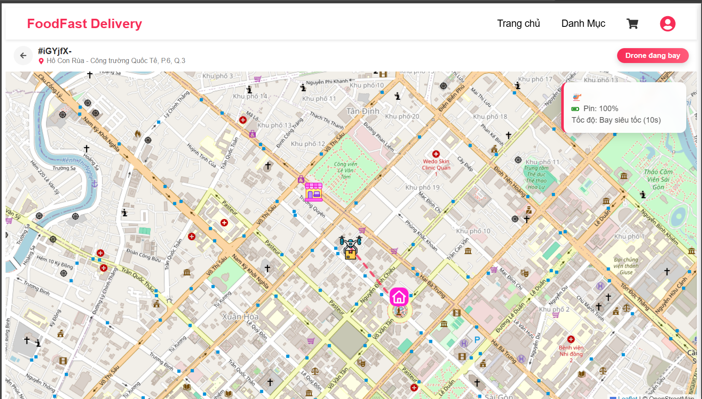
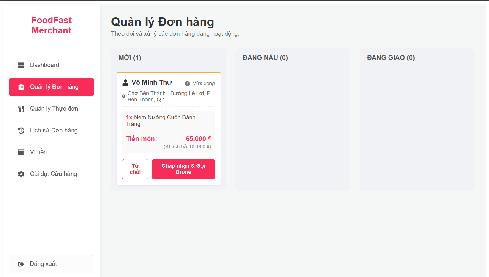
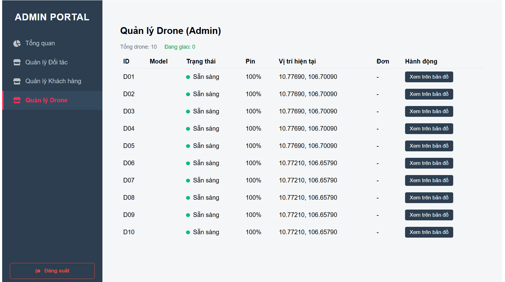

# FOODFAST DELIVERY (Monorepo) - Drone Delivery System

**FoodFast Delivery** là một nền tảng Web Application mô phỏng hệ thống giao đồ ăn nhanh bằng Drone tự động. Dự án tập trung vào trải nghiệm người dùng Real-time, mô phỏng quy trình logistics khép kín từ lúc khách đặt món, nhà hàng điều phối Drone, cho đến khi Drone giao hàng tận nơi trên bản đồ thực tế.

---

## 🌟 Tính Năng Nổi Bật (Key Features)

### 1. 🧑‍💻 Phân hệ Khách hàng (Customer App)
* **Đặt hàng nhanh:** Giao diện duyệt món, giỏ hàng thông minh (xử lý xung đột nhà hàng).
* **Real-time Tracking:** Theo dõi vị trí Drone di chuyển trực tiếp trên bản đồ (OpenStreetMap).
* **Mô phỏng 3D:** Hiển thị đầy đủ Icon Nhà, Quán và Drone đang bay.
* **Thông báo:** Popup chúc mừng khi nhận hàng thành công.

### 2. 🏪 Phân hệ Đối tác (Merchant Portal)
* **Dashboard:** Thống kê doanh thu, đơn hàng theo ngày/tuần.
* **Kanban Board:** Quản lý quy trình đơn hàng (Mới -> Đang nấu -> Đang giao).
* **Điều phối Drone (Drone Dispatch):** Tự động tìm kiếm Drone rảnh từ Hub gần nhất để gán cho đơn hàng.
* **Auto-Update:** Trạng thái Drone và Đơn hàng tự động cập nhật.

### 3. 🛡️ Phân hệ Quản trị (Admin Portal)
* **Drone Fleet Map (God View):** Bản đồ toàn cảnh theo dõi vị trí của tất cả 10+ Drone và các Trạm sạc (Hub) trong thành phố.
* **Quản lý người dùng/Đối tác:** Duyệt, khóa tài khoản Merchant/Customer.
* **Thống kê hệ thống:** Số liệu tổng quan thời gian thực.

---

## 🛠️ Công Nghệ Sử Dụng (Tech Stack)

Dự án được xây dựng theo kiến trúc **Monorepo** với các công nghệ hiện đại:

* **Core:** ReactJS (Vite), TypeScript.
* **State Management:** **Zustand** (Quản lý Auth, Cart, Drone, Admin Global State).
* **Maps & GIS:** **Leaflet**, **React-Leaflet**, OpenStreetMap.
* **Styling:** Styled-components.
* **Routing:** React Router DOM v6.
* **Mock Backend:** **Json-server** (Giả lập RESTful API, Database, Polling).
* **Icons:** React-icons, Flaticon.

---

## ⚙️ Cơ Chế Giả Lập Drone (Simulation Engine)

1.  **Client-side Simulation:** Sử dụng Hook `useDroneSimulation` để tính toán tọa độ nội suy tuyến tính (Linear Interpolation).
2.  **Logic di chuyển:**
    * **Chặng 1:** Hub -> Nhà hàng (Pickup).
    * **Chặng 2:** Nhà hàng -> Khách hàng (Delivery).
    * **Chặng 3:** Khách hàng -> Quay về Hub (Return/Idle).
3.  **Smart Merge & Polling:** Kỹ thuật đồng bộ dữ liệu giúp Drone cập nhật trạng thái từ Server về Client mượt mà.

---

## 📸 Hình ảnh Demo (Screenshots)

### 1. Theo dõi đơn hàng (Customer Tracking)

*Khách hàng xem Drone bay từ quán về nhà.*

### 2. Quản lý đơn hàng (Merchant Kanban)

*Nhà hàng nhận đơn và bấm nút gọi Drone.*

### 3. Quản lý Drone (Admin)

*Admin theo dõi toàn bộ hệ thống Drone hoạt động.*

---

## 🚀 Cài đặt và Chạy dự án (Installation)

Yêu cầu: Node.js (v16 trở lên)

### Bước 1: Clone dự án
```bash
git clone [https://github.com/vvinh118/FoodFast-Delivery.git](https://github.com/vvinh118/FoodFast-Delivery.git)
cd FoodFast-Delivery
```

### Bước 2: Cài đặt thư viện
```Bash
# Tại thư mục gốc
npm install
```

### Bước 3: Khởi động Json-server
Mở một terminal riêng và chạy:
```Bash
npm run serve-api
```
### Bước 4: Khởi động Web App:
Mở một terminal khác và chạy:
```Bash
npm run dev:web
```

---

## Truy cập

### 1. Customer:
http://localhost:5173

### 2. Merchant:
http://localhost:5173/merchant/login

### 3. Admin:
http://localhost:5173/admin

---

## 🤝 Đóng góp (Contributors)
Phạm Nguyễn Viết Vinh

Võ Minh Thư